# MOCKTAILS_RECIPES_FINDER_FLUTTER_APPLICATION:star_struck:

[](https://shields.io/) [](https://shields.io/) [](https://shields.io/) [](https://shields.io/) [](https://shields.io/) [](https://shields.io/)

***This new Web application is created by Biswarup Bhattacharjee, student of BTECH, in University of Engineering and Management, Kolkata.***

**Email Id: bbiswa471@gmail.com.** 

**Contact No: 916290272740.** 

[](https://www.facebook.com/biswarup.bhattacharjee.5811) [](https://github.com/biswa2210)

## About :point_down: 
A mocktail is a cocktail without the liquor.  Instead, juices, sodas, infused waters and many other non-alcoholic ingredients, mixed in just the right ratios, provide flavor.

Made at the restaurant’s bar, modern mocktails tend to have a sense of sophistication that’s shared with their alcoholic counterparts, using a variety of ingredients that cover a spectrum of flavors. Often, those flavors can mimic bourbon, gin, vermouth, bitters, and other staples in the bartender’s kit.

The drinks that accompany a dish influence the overall flavor and experience of a meal. The atmosphere of the restaurant, the appetizers and desserts that come before and after, and the drinks that accompany the dish all converge to craft an engaging dining experience.

Drinks are an especially important topic to consider. While beer, wine and cocktails can all complement a meal, non-alcoholic drinks are sometimes overlooked. <br>
Mocktails are very famous for celebrations, parties, occations and functions all over the world. People also make mocktails in their home.
I have made this application for finding mocktail recipes. **Here we can read 83 mocktails's recipes over 12 countries.** By clicking on each country we will see that country's famous and mouthwatering nutritious mocktails. We can read about ingredients, procedure, making time of each mocktali. Also we can see is it affordable or if it is pricey. We can add mocktails in favourite list so that in future it will easily be found. In the filters portion we can specify our choices by 6 catagories.* We can easily find expensive, halloween special, affordable, alcoholic or non alcoholic mocktails as per our choice.* We can seperate alcoholic or non-alcoholic drinks which is really useful.<br>
## APP DOWNLOAD LINK : :point_right: <a href="https://github.com/biswa2210/MOCKTAILS_RECIEPES/raw/master/Famous_Mocktails_base.apk" download>Click here to download</a>
## Purpose :point_down:

## Use :point_down:

## Importance :point_down:

## Folder Structure :point_down:
```bash
mocktail-recipe-finder
       ├── assets
       |     ├── fonts
       |     |     ├── CT.ttf
       |     |     ├── LG.ttf
       |     |     ├── OS.ttf
       |     |     ├── PH.ttf
       |     |     └── SM.ttf
       |     └── images
       |           ├── attachment.gif
       |           └── loading.gif
       └── lib 
             ├── models
             |      ├── catagories.dart
             |      ├── mocktails.dart
             |      └── mocktail_datas.dart
             ├── screens
             |      ├── catagori_mocktails_screen.dart
             |      ├── catagories_screens.dart
             |      ├── favorite_screen.dart
             |      ├── filters_screen.dart
             |      ├── mocktail_recipe_details.dart
             |      └── tabs_screen.dart
             ├── widgets
             |      ├── catagory_item.dart
             |      ├── main_drawer.dart
             |      └── movktail_details.dart
             ├── name.dart
             └── main.dart
 ```                      

## Making :point_down:
This flutter application is totally responsive. When we change the orientation the app fits in that. I have used [FLUTTER](https://flutter.dev/?gclid=Cj0KCQjw38-DBhDpARIsADJ3kjliHdMH2hA97bBGqJtW5ORUUksCxpZ8cnrSWaH__HevGftAmP8AmvIaAhNlEALw_wcB&gclsrc=aw.ds) and [Dart](https://dart.dev/) in front end and backend. I have used total six screens. Mocktail catagories screen, favourites screen, filter screen, Mocktail recipe description screen, tap screen, catagories screen. I have designed this using [Materials ui](https://material-ui.com/). I have loaded the entire app in main.dart.
## Screenshots :point_down: 
<div align="center">
<a href="m1.jpeg">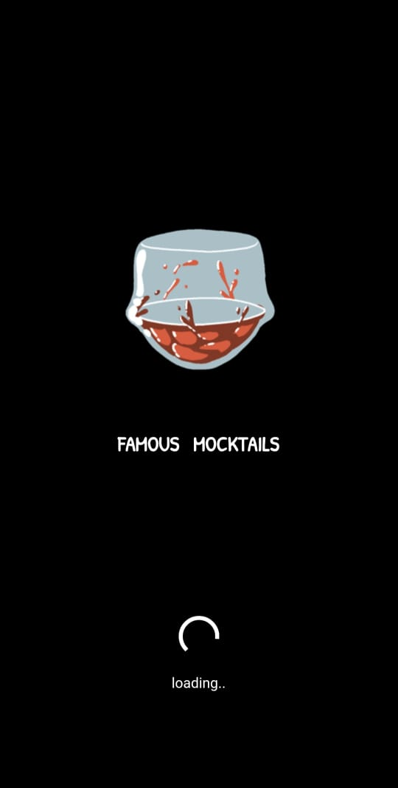</a> <a href="m2.jpeg">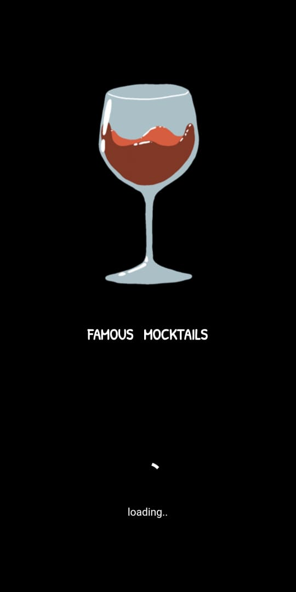</a>
       
<a href="m3.jpeg">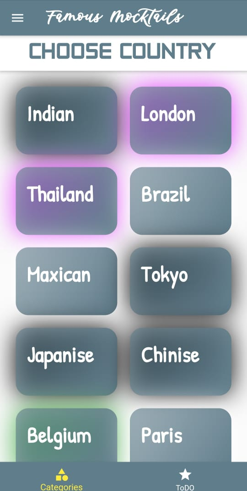</a> <a href="m4.jpeg">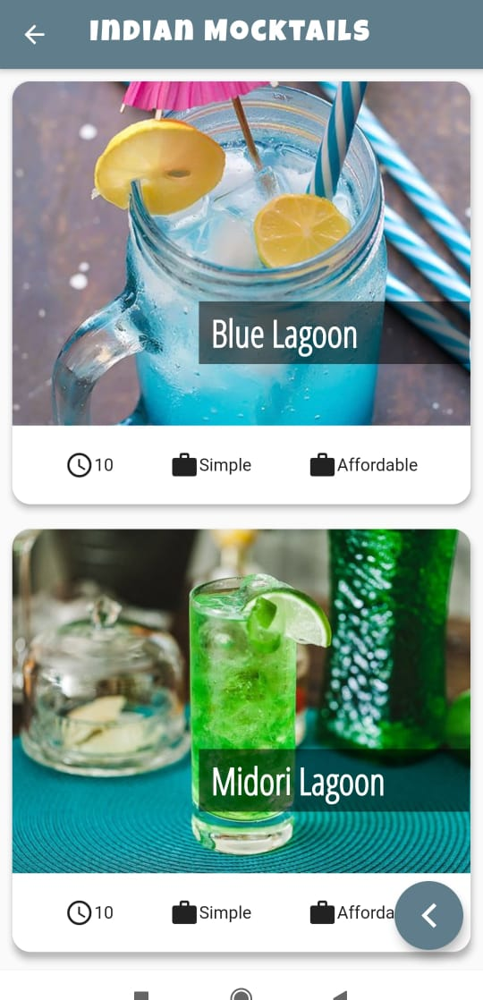</a>

<a href="m5.jpeg">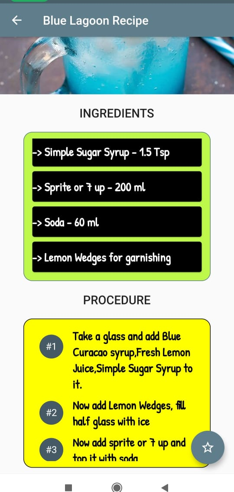</a> <a href="m6.jpeg"></a>
     
<a href="m7.jpeg">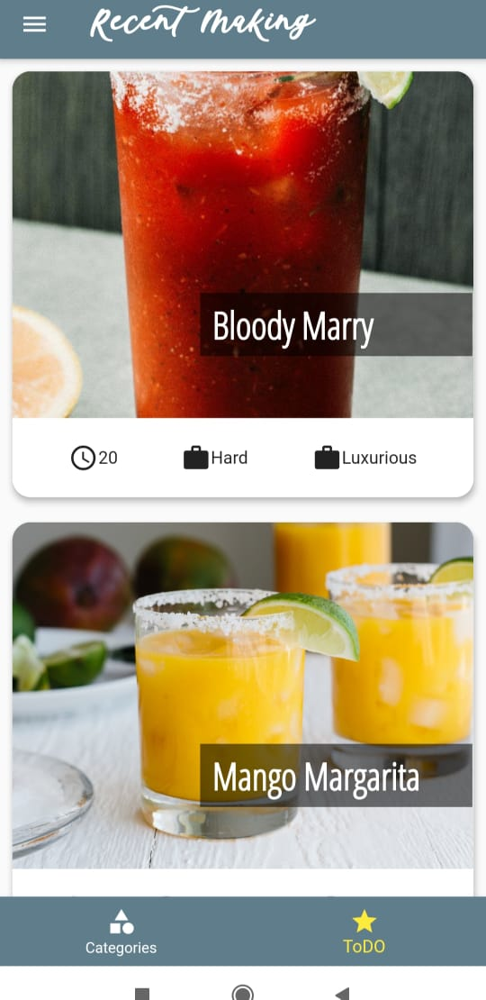</a> <a href="m8.jpeg">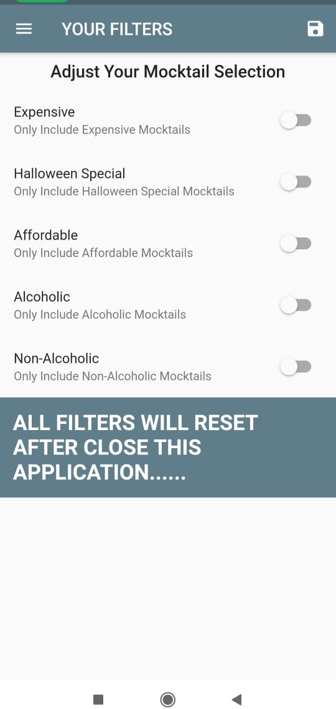</a>

<a href="m9.jpeg">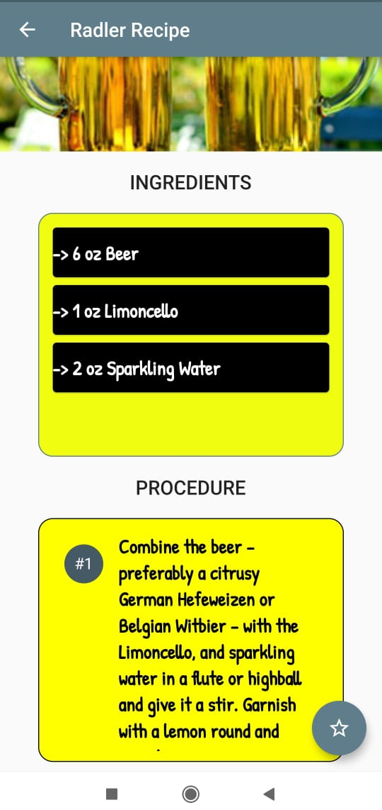</a> <a href="m10.jpeg">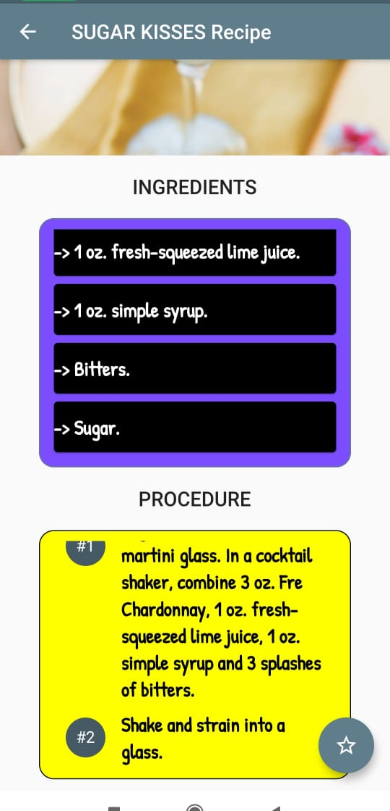</a>

<a href="m11.jpeg">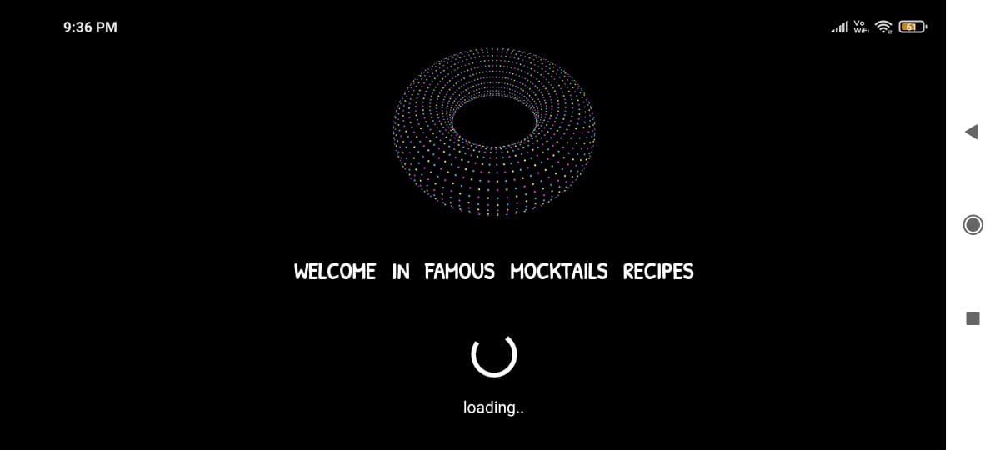</a> <a href="m12.jpeg">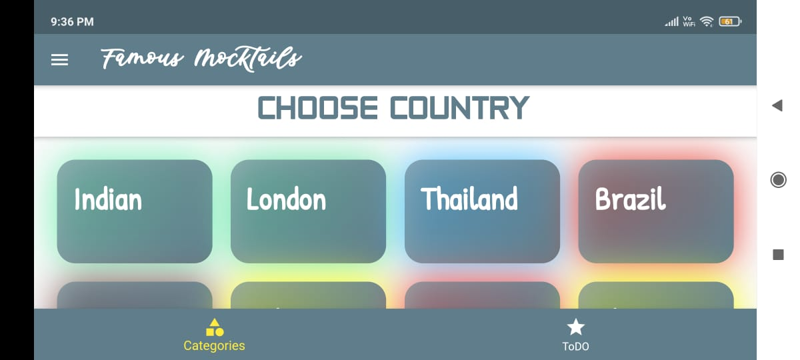</a>

<a href="m13.jpeg"></a> <a href="m14.jpeg">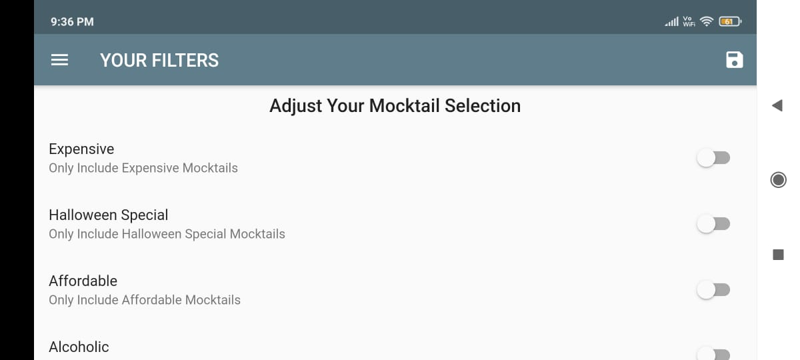</a>
     
<a href="m15.jpeg">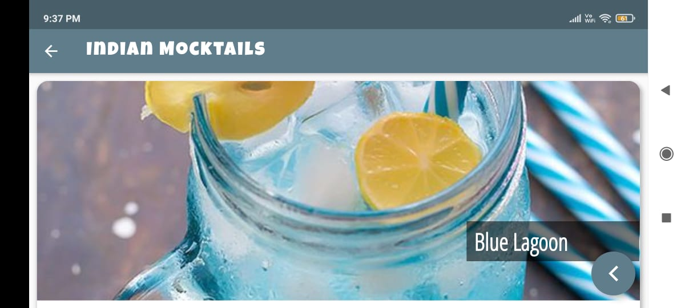</a> <a href="m16.jpeg">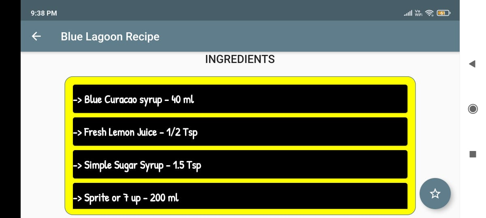</a>
</div>

## Getting Started :point_down: 

This project is a starting point for a Flutter application.

A few resources to get you started if this is your first Flutter project:

- [Lab: Write your first Flutter app](https://flutter.dev/docs/get-started/codelab)
- [Cookbook: Useful Flutter samples](https://flutter.dev/docs/cookbook)

For help getting started with Flutter, view our
[online documentation](https://flutter.dev/docs), which offers tutorials,
samples, guidance on mobile development, and a full API reference.
